<!--
  ASTEROIDS
  README pensado para GitHub/GitLab. Sem dependência de imagens externas além dos badges.
-->

<p align="center">
  
</p>

<h1 align="center">ASTEROIDS</h1>

<p align="center">
  Arcade moderno inspirado no clássico Asteroids, feito para rodar liso no browser com TypeScript e Canvas.
  Inclui modos de jogo, dificuldades, power-ups, UFO, ranking local e progressão meta com Núcleos e Skill Tree.
</p>

<p align="center">
  
  
  
  
</p>

---

## Visão geral

Este projeto implementa um loop de jogo enxuto (fixed step em 30 FPS) com foco em gameplay rápido, leitura de código e boa sensação de impacto:
partículas, flash, shake, trilhas de laser, HUD e overlays em DOM.

O jogo roda 100% no navegador e salva progresso localmente (sem backend).

---

## Principais recursos

- Modos: Classic, Time Attack (2:00), One Life, Endless
- Dificuldades: Easy, Normal, Hard (vidas e tuning próprios)
- Power-ups: Triple, Shield, Slow, Rapid, Score x2 (com barra dinâmica)
- UFO: spawn, tiros e pontuação específica (sirene opcional)
- Sistema de combo, precisão e pontuação com feedback visual
- Progressão meta:
  - Núcleos por performance
  - Skill Tree com upgrades reais (aceleração, fricção, laser, drops, contratos)
- Ranking local Top 10 por modo e dificuldade

---

## Controles

Teclado:

- Seta esquerda / direita: girar
- Seta para cima: impulso
- Espaço: atirar
- P ou Esc: pausar
- F: exibir FPS (modo dev)

Mobile e touch:

- Os botões touch aparecem automaticamente em dispositivos com pointer coarse
- Também é possível forçar pelos ajustes do jogo

---

## Rodando localmente

Pré-requisitos:
- Node.js (recomendado: LTS)
- npm

Clonar e instalar:

```bash
git clone <URL_DO_SEU_REPO>
cd asteroids
npm install
````

Ambiente de desenvolvimento:

```bash
npm run dev
```

Por padrão, o Vite sobe em porta fixa:

* [http://localhost:5173](http://localhost:5173)

---

## Build e preview

Build de produção:

```bash
npm run build
```

Preview local do build:

```bash
npm run preview
```

---

## Áudio

Observação importante: navegadores bloqueiam autoplay.
O áudio começa depois da primeira interação (ex.: clicar em JOGAR).

Arquivos esperados em:

```txt
public/sounds/
  explode.m4a
  hit.m4a
  laser.m4a
  thrust.m4a
  music-low.m4a
  music-high.m4a
```

Arquivos opcionais (o jogo funciona sem eles, mas você pode ver 404 no console se não existirem):

```txt
public/sounds/
  power.m4a
  ufo_hit.m4a
  siren.m4a
```

---

## Estrutura do projeto (como está hoje)

```txt
src/
  env.d.ts
  main.ts        # entry do Vite
  game.ts        # boot + loop + entidades + UI + meta
  styles.css     # UI, HUD, overlays e skill tree
public/
  sounds/        # trilhas e efeitos
.github/
  hero.svg       # banner do projeto
  readme-anim.svg
```

Se você decidir evoluir a organização sem mudar o gameplay, um caminho natural é separar `game.ts` por módulos (engine, entities, systems, ui, meta).

---

## Persistência local (localStorage)

O jogo é offline-first e guarda dados localmente:

* High score geral: `highscore`
* Meta progressão (Núcleos + skills): `asteroids_meta_v1`
* Ranking Top 10 por modo/dificuldade: `asteroids_lb_<modo>_<diff>`

---

## Ajustes e tuning

Os principais pontos de ajuste ficam em `src/game.ts`:

* `MODES`: modos e time limit
* `DIFFS`: tuning base por dificuldade
* `BASE`: constantes do gameplay (laser, invencibilidade, etc.)
* `POWER`: power-ups e durações
* `SKILLS`: árvore de habilidades e modificadores
* Cálculo de Núcleos por run: `calcCoresEarned()`

Porta do dev server (Vite): `vite.config.ts`.

---

## Contribuindo

Sugestões que combinam com o escopo do projeto:

* Novos modos (Boss Rush, Contracts-only, Daily seed)
* Novos inimigos (mines, drones) e variações de UFO
* Seeds/replays (salvar inputs)
* Ranking online opcional mantendo o ranking local como padrão
